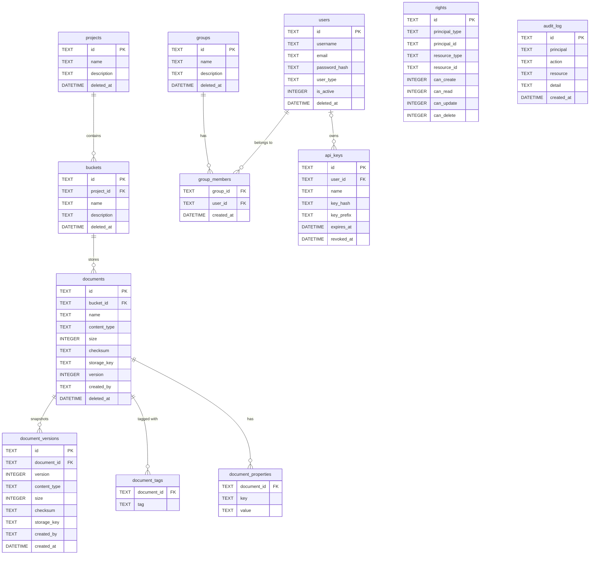

# TinyDM — Database Structure & Design

This document describes every table in the TinyDM schema, the relationships between them, and how the database design maps to the core concepts in the solution.

---

## Overview

TinyDM supports two database backends, selected at runtime via `TINYDM_DB_DRIVER`:

- **SQLite** (default) — via [modernc/sqlite](https://gitlab.com/cznic/sqlite), no CGO required. The database is a single file; the default path is `tinydm.db`, configurable via `TINYDM_DB_PATH`.
- **PostgreSQL** — via [pgx/v5](https://github.com/jackc/pgx). Set `TINYDM_DB_DRIVER=postgres` and provide `TINYDM_DB_DSN` with a libpq connection string.

Both drivers are compiled into every binary. Schema changes are managed by **Goose** using driver-specific embedded migration files: `internal/db/migrations/` for SQLite and `internal/db/migrations_pg/` for PostgreSQL. Migrations run automatically on startup.

File content is **not** stored in the database. Instead, a separate content-addressed filesystem store holds the raw bytes (see [Content storage](#content-storage) below). The database only stores metadata and a `storage_key` pointer to the file on disk.

---

## Entity relationship



All child tables cascade-delete when their parent is deleted. Projects, buckets, documents, users, and groups use **soft-delete** (`deleted_at` column) so records are hidden from queries but retained for audit purposes.

---

## Tables

### `projects`

A logical grouping of buckets. Projects allow large organisations to separate work by team, client, or workstream.

| Column | Type | Notes |
|---|---|---|
| `id` | TEXT PK | UUID |
| `name` | TEXT UNIQUE | Globally unique display name |
| `description` | TEXT | |
| `created_at` | DATETIME | |
| `updated_at` | DATETIME | |
| `deleted_at` | DATETIME | Soft-delete |

---

### `buckets`

A named container of documents within a project. Analogous to a folder or an S3 bucket.

| Column | Type | Notes |
|---|---|---|
| `id` | TEXT PK | UUID |
| `project_id` | TEXT FK → `projects.id` | CASCADE DELETE |
| `name` | TEXT | Unique within the project |
| `description` | TEXT | |
| `created_at` | DATETIME | |
| `updated_at` | DATETIME | |
| `deleted_at` | DATETIME | Soft-delete |

**Indexes:** `idx_buckets_project` on `(project_id)`

---

### `documents`

The core record. Represents a named file within a bucket. The document row holds metadata only — the actual bytes live in the content store.

| Column | Type | Notes |
|---|---|---|
| `id` | TEXT PK | UUID |
| `bucket_id` | TEXT FK → `buckets.id` | CASCADE DELETE |
| `name` | TEXT | Unique within the bucket |
| `content_type` | TEXT | MIME type detected on upload |
| `size` | INTEGER | Byte count of the current version |
| `checksum` | TEXT | SHA-256 hex digest of the current content |
| `storage_key` | TEXT | Path within the content store (`ab/cdef1234…`) |
| `version` | INTEGER | Monotonically incrementing counter; starts at 1 |
| `created_by` | TEXT | Username or API-key identifier of the uploader |
| `created_at` | DATETIME | |
| `updated_at` | DATETIME | |
| `deleted_at` | DATETIME | Soft-delete |

**Indexes:** `idx_documents_bucket` on `(bucket_id)`, `idx_documents_checksum` on `(checksum)`

**Design rationale:** `checksum` and `storage_key` are derived from the content-addressed store. Because two documents with identical bytes share the same `storage_key`, the `idx_documents_checksum` index makes duplicate-detection fast. The `version` counter is incremented atomically with each update and never reset; it is the user-visible version number displayed in the UI and API.

---

### `document_versions`

An immutable snapshot written before every document update or restore. The version table is append-only — rows are never modified or deleted (except by CASCADE when the parent document is hard-deleted).

| Column | Type | Notes |
|---|---|---|
| `id` | TEXT PK | UUID |
| `document_id` | TEXT FK → `documents.id` | CASCADE DELETE |
| `version` | INTEGER | Version number being archived (the old value) |
| `content_type` | TEXT | MIME type at the time of the snapshot |
| `size` | INTEGER | Byte count at the time of the snapshot |
| `checksum` | TEXT | SHA-256 digest at the time of the snapshot |
| `storage_key` | TEXT | Content-store key at the time of the snapshot |
| `created_by` | TEXT | Principal who triggered the update |
| `created_at` | DATETIME | When the snapshot was taken |

**Indexes:** `idx_doc_versions_document` on `(document_id)`

**Design rationale:** Before any update, the repository layer copies the current `documents` row into `document_versions`, increments `version` on the live row, and writes the new content to the store. On a restore, the live row is updated to point at a previous `storage_key` and a new snapshot of the state being replaced is written first — so every state transition is lossless and reversible.

Because both tables reference `storage_key` independently, the content store never deletes a file that is still pointed to by a version snapshot.

---

### `document_tags`

A many-to-many join table between documents and free-form string labels. No tag table exists — tags are just strings; the uniqueness constraint is enforced by the composite primary key.

| Column | Type | Notes |
|---|---|---|
| `document_id` | TEXT FK → `documents.id` | CASCADE DELETE |
| `tag` | TEXT | Free-form label |

**Primary key:** `(document_id, tag)`

**Design rationale:** Keeping tags in a flat join table (rather than a JSON column or a normalised tag dictionary) makes filtered list queries simple: `WHERE document_id IN (SELECT document_id FROM document_tags WHERE tag = ?)`. There is no overhead of maintaining a separate tags master table, and tag values are bounded per document so the table stays small.

---

### `document_properties`

Custom key/value metadata attached to a document at runtime. Keys starting with `sys.` are reserved for system-extracted metadata (image dimensions, PDF version, Office container type); all other keys are user-defined.

| Column | Type | Notes |
|---|---|---|
| `document_id` | TEXT FK → `documents.id` | CASCADE DELETE |
| `key` | TEXT | Property name |
| `value` | TEXT | Property value (stored as a string) |

**Primary key:** `(document_id, key)`

**Design rationale:** A flat key/value model was chosen over a JSON column because it allows individual properties to be upserted and deleted without deserialising the whole blob. The number of properties per document is small (typically fewer than 20), so a join is cheap.

**Extracted property keys by content type:**

| Namespace | Keys | Content types |
|---|---|---|
| `image.*` | `image.width`, `image.height`, `image.format` | all `image/*` |
| `image.*` (EXIF) | `image.make`, `image.model`, `image.datetime`, `image.orientation`, `image.gps_lat`, `image.gps_lon` | `image/jpeg` |
| `pdf.*` | `pdf.version`, `pdf.pages`, `pdf.title`, `pdf.author` | `application/pdf` |
| `office.*` | `office.container` (`ooxml`/`ole2`), `office.title`, `office.author` | all Office MIME types |
| `office.*` | `office.word_count` | `application/vnd...wordprocessingml.document` |
| `office.*` | `office.slide_count` | `application/vnd...presentationml.presentation` |
| `office.*` | `office.sheet_count` | `application/vnd...spreadsheetml.sheet` |
| `audio.*` | `audio.title`, `audio.artist`, `audio.album`, `audio.year`, `audio.format` | `audio/mpeg`, `audio/mp4`, `audio/x-m4a`, `audio/flac`, `audio/x-flac`, `audio/ogg` |
| `video.*` | `video.duration_s`, `video.width`, `video.height` | `video/mp4`, `video/quicktime` |
| `text.*` | `text.lines`, `text.encoding` | `text/plain`, `text/csv`, `text/html`, `text/css`, `text/javascript`, `application/json`, `application/xml`, `text/xml` |

All extraction is best-effort — missing or unparseable fields are omitted rather than written as empty strings.

---

### `audit_log`

An append-only record of every mutating operation. Rows are written asynchronously by the audit middleware after any `POST`, `PUT`, or `DELETE` that returns 2xx. Rows are never updated or deleted.

| Column | Type | Notes |
|---|---|---|
| `id` | TEXT PK | UUID |
| `principal` | TEXT | Username or API-key `key_prefix` of the actor |
| `action` | TEXT | Dot-notation action string, e.g. `document.create` |
| `resource` | TEXT | UUID of the affected resource |
| `detail` | TEXT | Optional JSON payload with additional context |
| `created_at` | DATETIME | |

**Indexes:** `idx_audit_principal` on `(principal)`, `idx_audit_created` on `(created_at)`

**Design rationale:** Rows are written asynchronously and are never updated or deleted, providing a tamper-evident history of all mutating operations. The two indexes support the most common query patterns: narrowing by principal and date-range slicing.

---

### `users`

Accounts that can authenticate via password (JWT or HTTP Basic).

| Column | Type | Notes |
|---|---|---|
| `id` | TEXT PK | UUID |
| `username` | TEXT UNIQUE | Globally unique login name |
| `email` | TEXT UNIQUE | Globally unique email address |
| `first_name` | TEXT | |
| `last_name` | TEXT | |
| `password_hash` | TEXT | bcrypt hash; never exposed via the API |
| `user_type` | TEXT | `'admin'` or `'user'`; enforced by CHECK constraint |
| `is_active` | INTEGER | 1 = active, 0 = deactivated |
| `created_at` | DATETIME | |
| `updated_at` | DATETIME | |
| `deleted_at` | DATETIME | Soft-delete |

**Design rationale:** `user_type` drives the two-level RBAC model. Admins have unrestricted system-wide access; users rely on `rights` grants for fine-grained access. `is_active` allows accounts to be suspended without deleting them, preserving audit trail references.

---

### `groups`

Named collections of users. Rights can be granted to a group to avoid per-user grant management.

| Column | Type | Notes |
|---|---|---|
| `id` | TEXT PK | UUID |
| `name` | TEXT UNIQUE | Globally unique group name |
| `description` | TEXT | |
| `created_at` | DATETIME | |
| `updated_at` | DATETIME | |
| `deleted_at` | DATETIME | Soft-delete |

---

### `group_members`

Membership join table between `users` and `groups`.

| Column | Type | Notes |
|---|---|---|
| `group_id` | TEXT FK → `groups.id` | CASCADE DELETE |
| `user_id` | TEXT FK → `users.id` | CASCADE DELETE |
| `created_at` | DATETIME | |

**Primary key:** `(group_id, user_id)`

**Indexes:** `idx_group_members_user` on `(user_id)` — supports "which groups does this user belong to?" queries efficiently.

---

### `api_keys`

Tokens that can authenticate requests without a password. The plaintext key is shown to the user exactly once on creation; only a SHA-256 hash is persisted.

| Column | Type | Notes |
|---|---|---|
| `id` | TEXT PK | UUID |
| `user_id` | TEXT FK → `users.id` (nullable) | SET NULL on user delete; NULL = system-scoped admin key |
| `name` | TEXT | Human-readable label |
| `key_hash` | TEXT UNIQUE | SHA-256(plaintext); used for lookup on every request |
| `key_prefix` | TEXT | First 12 characters of the plaintext key (`tdm_xxxxxxxx`) for display |
| `created_at` | DATETIME | |
| `expires_at` | DATETIME | NULL = no expiry |
| `last_used_at` | DATETIME | Updated on each successful authentication |
| `revoked_at` | DATETIME | NULL = active; set = revoked |

**Indexes:** `idx_api_keys_key_hash` on `(key_hash)`

**Design rationale:** Every inbound API-key request hashes the presented key and looks up `key_hash` using the unique index — O(log n), constant cost regardless of how many keys exist. `key_prefix` gives administrators enough information to identify which key was used in logs without exposing the secret. A key tied to a user (`user_id` NOT NULL) inherits that user's rights; a system-scoped key (NULL) has admin-level access.

---

### `rights`

Fine-grained RBAC grants. A right connects a principal (user or API key) to a resource (and optionally a specific resource ID) and records which CRUD operations are permitted.

| Column | Type | Notes |
|---|---|---|
| `id` | TEXT PK | UUID |
| `principal_type` | TEXT | `'user'`, `'group'`, or `'apikey'`; enforced by CHECK constraint |
| `principal_id` | TEXT | UUID of the user, group, or API key |
| `resource_type` | TEXT | `'project'`, `'bucket'`, or `'document'`; enforced by CHECK constraint |
| `resource_id` | TEXT | UUID of a specific resource, or `'*'` for all resources of that type |
| `can_create` | INTEGER | 0/1 boolean |
| `can_read` | INTEGER | 0/1 boolean |
| `can_update` | INTEGER | 0/1 boolean |
| `can_delete` | INTEGER | 0/1 boolean |

**Indexes:** `idx_rights_principal` on `(principal_type, principal_id)`

**Design rationale:** The `resource_id = '*'` wildcard allows a single row to grant access to all resources of a type (e.g. "this user can read all projects") without enumerating every resource. The four separate boolean columns make it straightforward to grant asymmetric rights (e.g. read-only access) without a bitmask. Permission levels are hierarchical: Delete implies Update implies Create implies Read — the UI enforces this by exposing a single level selector rather than independent checkboxes. Admin users bypass the rights table entirely; rights are only evaluated for `user`-type principals.

---

### `cluster_nodes`

Tracks running TinyDM instances for heartbeat monitoring and leader election. On single-node or SQLite deployments this table exists but is never written to.

| Column | Type | Notes |
|---|---|---|
| `node_id` | TEXT PK | Unique identifier for the process (e.g. hostname + PID) |
| `last_heartbeat` | TEXT | ISO-8601 timestamp, updated periodically by the node |
| `is_leader` | INTEGER | 1 = this node is the current cluster leader |

---

## Content storage

File bytes are stored outside the database in a **content-addressed filesystem** (`internal/storage`).

```
data/content/
  ab/
    cdef1234...   ← full SHA-256 = "abcdef1234..."
  f3/
    9a7b2c...
```

The storage key written to `documents.storage_key` and `document_versions.storage_key` is `<first2>/<remaining62>` of the SHA-256 hex digest. This means:

- **Deduplication is automatic** — uploading the same bytes twice produces the same key; the second write is discarded and both document rows point to the same file.
- **No orphaned files from updates** — the old file is still referenced by a `document_versions` row until the version history is explicitly pruned.
- **Storage is append-only by default** — files are written once and never modified in place, making the store safe to back up with rsync or snapshot-based tools.

The `storage.Store` interface (`internal/storage/storage.go`) abstracts the backend so alternative implementations (S3, NFS, etc.) can be swapped in without changing any other layer.

---

## Migration strategy

Migrations are sequential SQL files managed by [Goose](https://github.com/pressly/goose) and embedded in the binary at build time:

Two migration sets are embedded in the binary — one per driver:

| Directory | Driver | File | Contents |
|---|---|---|---|
| `migrations/` | SQLite | `001_initial_schema.sql` | Core hierarchy: projects, buckets, documents, document_versions, document_tags, document_properties, audit_log |
| `migrations/` | SQLite | `002_auth_schema.sql` | Authentication & authorisation: users, groups, group_members, api_keys, rights |
| `migrations/` | SQLite | `003_cluster_nodes.sql` | Adds `cluster_nodes` table for heartbeat and leader election |
| `migrations/` | SQLite | `004_superadmin_role.sql` | Extends `user_type` CHECK to include `'superadmin'` |
| `migrations/` | SQLite | `005_user_names.sql` | Adds `first_name` and `last_name` columns to `users` |
| `migrations/` | SQLite | `006_permission_system.sql` | Widens rights `principal_type` to include `'apikey'`; widens `resource_type` to include `'document'` |
| `migrations/` | SQLite | `007_remove_tenants.sql` | Removes multi-tenancy: drops `tenants` table, `tenant_id` columns; downgrades `superadmin` → `admin`; adds `UNIQUE(name)` to projects, users, groups globally |
| `migrations_pg/` | PostgreSQL | `001_initial_schema.sql` | Same as above; uses `TIMESTAMPTZ` instead of `DATETIME`, `BIGINT` for sizes |
| `migrations_pg/` | PostgreSQL | `002_auth_schema.sql` | Same as above; uses `TIMESTAMPTZ` |
| `migrations_pg/` | PostgreSQL | `003_cluster_nodes.sql` | Same as SQLite 003 |
| `migrations_pg/` | PostgreSQL | `004_superadmin_role.sql` | Same as SQLite 004 |
| `migrations_pg/` | PostgreSQL | `005_user_names.sql` | Same as SQLite 005 |
| `migrations_pg/` | PostgreSQL | `006_remove_tenants.sql` | Same as SQLite 007; uses `ALTER TABLE DROP COLUMN` |

Goose runs all pending migrations automatically on startup. Each migration file contains an `-- +goose Up` block (applied forward) and a `-- +goose Down` block (rollback). This means the schema can be rolled back to any point without manual SQL.

---

## Soft-delete pattern

The following tables use soft-delete: `projects`, `buckets`, `documents`, `users`, `groups`.

A `deleted_at DATETIME` column is present on each. All application queries include a `WHERE deleted_at IS NULL` filter so soft-deleted records are invisible to normal operations. Records are retained so that:

- Audit log entries that reference a deleted resource still resolve correctly.
- Historical version snapshots for a deleted document are preserved.
- Accidental deletes can be recovered by clearing `deleted_at` directly in the database.

Hard deletion (physically removing rows) is not exposed via the API and would require a manual database operation or a future housekeeping job.

---

## Key design decisions

| Decision | Rationale |
|---|---|
| SQLite as default, PostgreSQL optional | SQLite gives zero-dependency single-binary deployment for the common case. PostgreSQL is available for deployments that need concurrent writers, replication, or managed-database integrations. Both share the same application code; a `db.DB` wrapper handles `?`→`$N` placeholder rebinding transparently. |
| UUIDs as primary keys | Avoids sequential integer leakage, supports distributed ID generation without coordination, and is safe to expose in URLs. |
| `TINYDM_PERM_MODE` env var | Sets the system-wide RBAC default: `open` (authenticated users can read everything) or `explicit` (all access requires a `rights` grant). Defaults to `explicit`. |
| SHA-256 storage keys | Content-addressed storage provides free deduplication and makes backup/replication simple. |
| bcrypt for passwords, SHA-256 for API keys | bcrypt is appropriate for human-chosen secrets (slow, salted). API keys are long random strings so a single fast hash is sufficient and avoids per-request bcrypt overhead. |
| `resource_id = '*'` wildcard in `rights` | Allows broad grants (e.g. "read all buckets") without enumerating every resource at grant time. |
| Separate `document_properties` table | Allows individual key upsert/delete without deserialising a JSON blob; keeps queries simple and indexed. |
